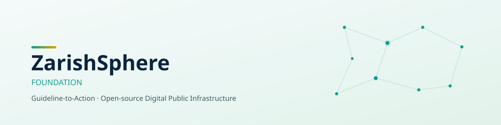

<picture>
  <source media="(prefers-color-scheme: dark)" srcset="./assets/banner-dark.svg">
  <source media="(prefers-color-scheme: light)" srcset="./assets/banner-light.svg">
  
</picture>

  

---

### What we are

**ZarishSphere Foundation** builds open-source **Digital Public Infrastructure** for forcibly
displaced populations. Our core product is the **Guideline-to-Action (G2A) Engine** — it takes
international health, protection, and humanitarian standards (WHO, UNHCR, SPHERE, ISO) and
turns them into deployable digital assets: forms, workflows, apps, and decision rules that
work in the field, not just on paper.

| | |
|---|---|
| 🌍 **Deployment context** | Cox's Bazar, Bangladesh — Rohingya FDMN population + host community |
| 🚀 **Scale intent** | Global from day one |
| ⚖️ **License** | Apache 2.0 (code) · CC BY 4.0 (documentation) |
| 💸 **Cost model** | Zero-budget, always-free-tier infrastructure only — see [`04-FREE-TIER-STACK-MATRIX`](https://github.com/zsdotcom/docs.zarishsphere) |
| 🧩 **Governance** | GitHub-as-government — every decision is a reviewable PR |

---

### Start here

---

### Repositories

| Repo | What it is | Status |
|---|---|---|
| [`docs.zarishsphere`](https://github.com/zsdotcom/docs.zarishsphere) | Single source of truth — architecture, standards mapping, governance |  |
| [`zarishsphere`](https://github.com/zsdotcom/zarishsphere) | The platform itself |  |
| [`zarish-index`](https://github.com/zsdotcom/zarish-index) | 40+ domain global standards index |  |
| [`zarish-standards`](https://github.com/zsdotcom/zarish-standards) | Standards classification registry |  |

---

### How this org runs — fully automated, always free

Every repo in `zsdotcom` inherits the same community health files, label set, and security
baseline from this repo. Dependency updates, secret scanning, code scanning, and release
changelogs run unattended — no paid tier, no seat licenses, no card on file.

---

### Contributing

We treat every contributor as a domain expert in their area — clinicians, humanitarian
protection officers, translators, and developers all shape this project through the same
PR-review process.

See the org-wide [CONTRIBUTING.md](../CONTRIBUTING.md) and
[CODE_OF_CONDUCT.md](../CODE_OF_CONDUCT.md) before opening your first PR.

Built by a solo-founder, four-owner foundation — reviewed in the open, deployed at zero cost.

